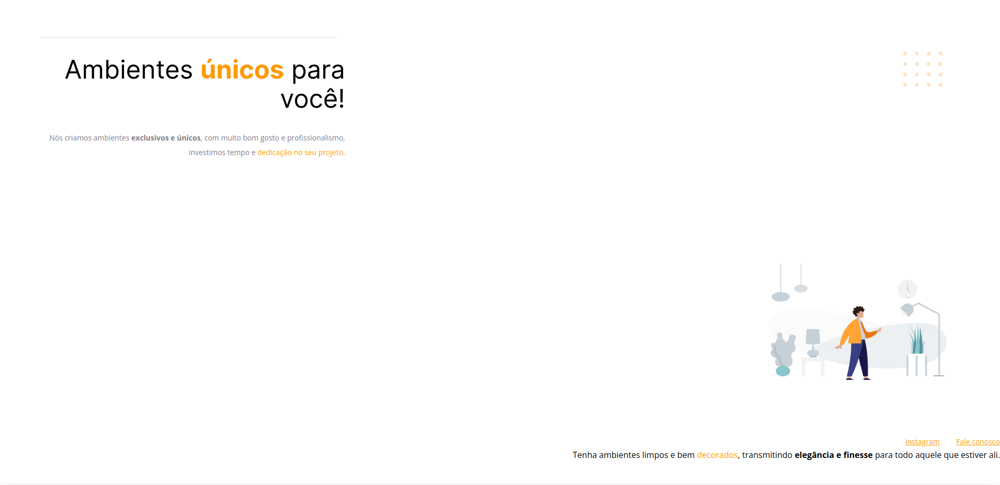
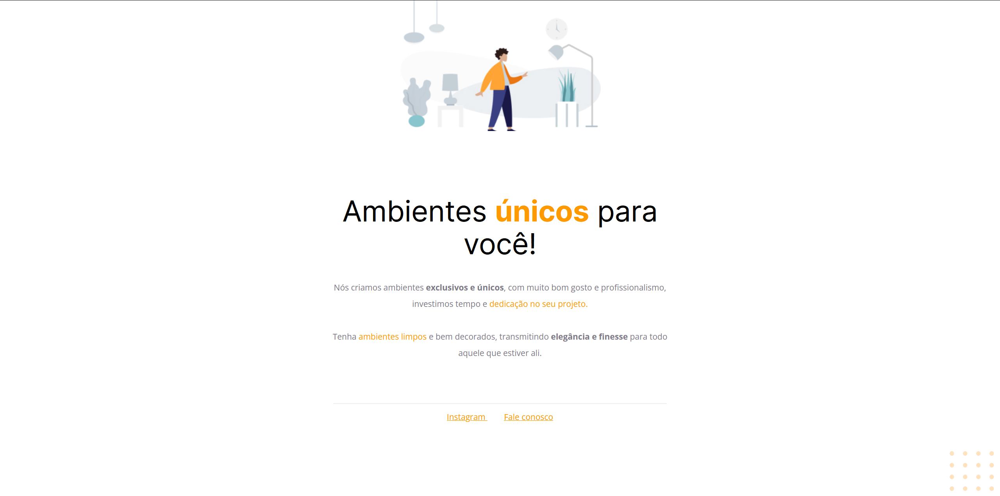

# Desafio da fase 01
## Corrigindo bugs :bug:
### Sobre o desafio
Nesse desafio, você receberá um código com o projeto desenvolvido durante as aulas da Fase 01.

Mas, a surpresa vem aí... **👀**  

O código sofreu algumas alterações e, como podemos ver na imagem abaixo, ele não está mais da mesma forma que o Maykão deixou.

Topa encarar esse desafio e deixar o site com a mesma carinha de antes?

### Desafio concluído
Código foi arrumado de maneira que o site ficasse igual ao que foi apresentado durante as aulas e igual ao que está no [Figma](https://www.figma.com/file/fAvYZz4dPV5MfhL77XkqkD/Explorer---Stage-01).

